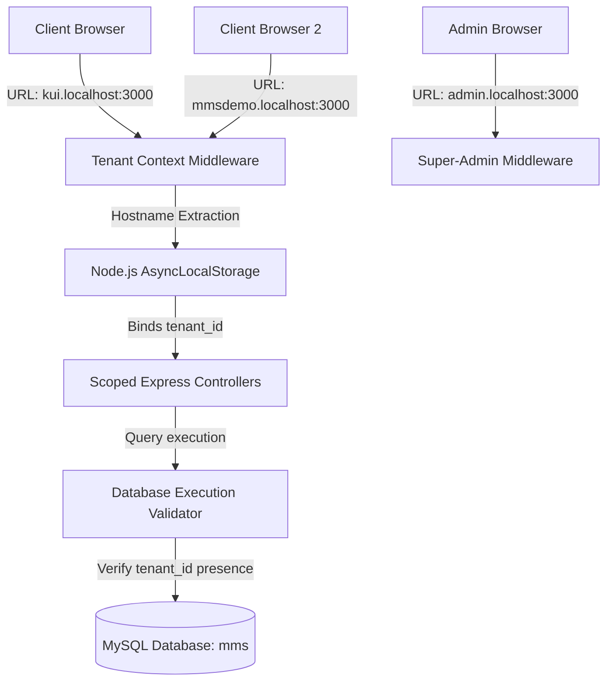

# Work Log & Architectural Case Study: Multi-Tenant SaaS Conversion

**Author:** Madrassa Management System (MMS) Engineering Team
**Date:** June 14, 2026
**Project:** Converting Single-Tenant Madrassa Management System to a Multi-Tenant SaaS Platform

---

## 📋 Executive Summary
This document serves as a detailed log of the structural, database, security, and interface changes implemented to migrate the single-tenant Madrassa Management System (MMS) to a highly scalable, multi-tenant Software-as-a-Service (SaaS) application. 

The primary goal of this architectural transition was to support multiple institutions (e.g., KUI Production and Jamia Habibullah Demo Account) on a shared server and database setup, while maintaining strict isolation, performance boundaries, customized branding, subscription quotas, and security checks.

---

## 🏗️ 1. Multi-Tenant Architectural Pattern

To maximize cost-efficiency, simplify maintenance, and streamline database migrations, we implemented a **Logical Isolation / Shared-Schema** model. 



### Key Components:
1. **Tenant Routing Middleware**: Inspects the incoming host header (e.g., `kui.localhost` or `mmsdemo.localhost`) to resolve the matching tenant record.
2. **Execution Context Management**: Leverages Node's `AsyncLocalStorage` to automatically propagate the active `tenantId` through the middleware and database execution stack, avoiding manual argument passing.
3. **Automated Security Guardrails**: Intercepts queries at the database driver level, throwing runtime exceptions in non-production environments if any query targets tenant-scoped tables without applying a `tenant_id` filter.

---

## 🗄️ 2. Database Schema Refactoring

We introduced structural changes via a Flyway-compatible migration file: [V4__multi_tenant_redesign.sql](file:///d:/kui-ms/sql/V4__multi_tenant_redesign.sql).

### A. Core SaaS Tables
- **`tenants`**: Manages subdomains, custom domains, plans (`free`, `pro`, `enterprise`), limits (max students, teachers, classes), and custom branding configs (colors, logos).
- **`master_admins`**: Globally isolated credentials for managing the SaaS platform.

### B. Logical Partitioning
Added `tenant_id INT NOT NULL` to the following tables:
- `users`, `students`, `teachers`, `classes`, `attendance_students`, `attendance_teachers`, `books`, `teacher_books`, `book_progress`, `periods`, `sessions`, `student_enrollments`, and `role_permissions`.

### C. Scope-Safe Constraints & Indexes
Converted table-level unique constraints to composite unique indexes scoped by `tenant_id` to prevent cross-tenant namespace collisions:
- **Users**: Unique `(tenant_id, username)`
- **Students**: Unique `(tenant_id, roll_number)`
- **Teachers**: Unique `(tenant_id, id_number)`
- **Books**: Unique `(tenant_id, title)`
- **Role Permissions**: Unique `(tenant_id, role, function_name)`

---

## 🛡️ 3. Security, Query Isolation & Guardrails

### A. Context Extraction (`middleware/tenant.js`)
We developed [middleware/tenant.js](file:///d:/kui-ms/middleware/tenant.js) to intercept all incoming requests.
- Maps `kui.*` subdomains to Tenant 2 (KUI Production) and `mmsdemo.*` subdomains to Tenant 1 (Demo Account).
- Extracts subdomain values dynamically, redirecting suspended or locked accounts immediately to a generic lockout screen ([views/suspended.ejs](file:///d:/kui-ms/views/suspended.ejs)).

### B. Development Guardrail Assertions (`db.js`)
To prevent accidental data leakage due to manual query errors, [db.js](file:///d:/kui-ms/db.js) wraps query execution and parses statements:
```javascript
const tenantScopedTables = [
  'users', 'students', 'teachers', 'classes', 'attendance_students',
  'attendance_teachers', 'books', 'teacher_books', 'book_progress',
  'periods', 'sessions', 'student_enrollments'
];

function validateTenantQuery(sql, tenantId) {
    const lowerSql = sql.toLowerCase();
    const targetsTenantTable = tenantScopedTables.some(table => {
        const regex = new RegExp(`\\b${table}\\b`);
        return regex.test(lowerSql);
    });

    if (targetsTenantTable && !lowerSql.includes('tenant_id')) {
        throw new Error(`Security Violation: Query on tenant-scoped table missing 'tenant_id' filter. SQL: "${sql}"`);
    }
}
```

---

## 📈 4. Quota Enforcement Logic

To enable tiered SaaS subscriptions, we created [utils/quota.js](file:///d:/kui-ms/utils/quota.js). Before creating records, the platform queries limits from the database and raises a quota exception if limits are breached.

- **Student Limit**: Enforced inside [controllers/studentController.js](file:///d:/kui-ms/controllers/studentController.js).
- **Teacher Limit**: Enforced inside [controllers/teacherController.js](file:///d:/kui-ms/controllers/teacherController.js).

---

## 🎨 5. Dynamic White-Label Branding

EJS templates now parse branding colors and icons dynamically from the resolved `tenant` object:
- **Tailored Stylesheets**: Injected via `<%- tenant.primary_color %>` and `<%- tenant.secondary_color %>` to dynamically set custom branding parameters.
- **Dynamic Logos**: Logos are read dynamically from database records (e.g., `/logo_demo.png` for Jamia Habibullah vs KUI logo).
- **Language Localization Switcher**: Added support for Urdu (`ur`) and Arabic (`ar`) locales, with default language toggling dynamically integrated based on user profile preferences.

---

## 👑 6. Network Super-Admin Dashboard (`admin.localhost:3000`)

Constructed a global administration panel with isolated authentication to manage the entire platform.
- **URL Boundaries**: `admin.localhost:3000` / `admin.mms.nukrim.local`.
- **Tenant Provisioner**: Add new schools and organizations.
- **Tenant Management**: Instantly upgrade subscription levels, modify custom quotas, toggle feature flags, update branding/logos, or suspend active tenants.
- **Seeding automation**: Automatically executes baseline permissions seeding whenever a new tenant is created.

---

## 🔍 7. Verification & Local Testing Plan

### A. Subdomain Local Mapping
Configured mapping inside the local `/etc/hosts` file (or Windows `C:\Windows\System32\drivers\etc\hosts`):
```text
127.0.0.1 mmsdemo.localhost
127.0.0.1 kui.localhost
127.0.0.1 admin.localhost
```

### B. Testing Checklists Executed
1. **Cross-Tenant Isolation Check**: Logged in to `mmsdemo.localhost` and `kui.localhost`. Confirmed that creating students or changing attendance records under one tenant never leaks or appears in the other tenant's views.
2. **Quota Checks**: Reduced `max_students` limit to `2` for Tenant 1 (Demo). Tried adding a third student and validated that the application blocked registration and displayed a clean validation message.
3. **Suspension Lock**: Changed Tenant 1's status to `suspended` inside the Super-Admin panel. Navigating to `mmsdemo.localhost` immediately locked out the tenant and rendered the suspension template.
